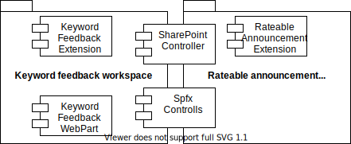
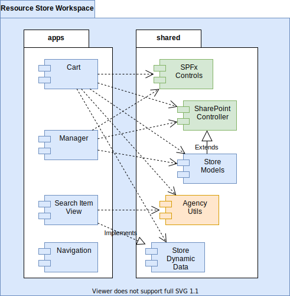

# Introduction

[](https://github.com/microsoft/fluentui/blob/master/packages/react/README.md)
[](https://mobx.js.org/)
[](https://nodejs.org/en/download/releases/)
[](https://pnp.github.io/pnpjs/)
[](https://docs.microsoft.com/en-us/sharepoint/introduction)
[](https://docs.microsoft.com/en-us/sharepoint/dev/spfx/sharepoint-framework-overview)
[](https://pnp.github.io/sp-dev-fx-controls-react/)
[](https://docs.microsoft.com/en-us/sharepoint/dev/spfx/debug-in-vscode#debug-web-part-solution-using-hosted-workbench)
[](https://yarnpkg.com/)

This is an example of a re-useable hybrid-repo, SharePoint (SPFx) MVC implementation. It uses git-modules, yarn workspaces, PnPjs, Spfx-Controls, MobX and Fluent UI.
The goal is to provide a starting point for rapid SPFX development.

## Summary

The example workspaces share the same SharePoint Controller and Spfx views.
It hopefully illustrates:

- git modules to organise reusable extendable projects (hybrid repro)
- reusable modules for the basics, data source access and presentation
- create a model for the SharePoint access
- focus on business logic development
- an extendable framework by YOUR contribution

## Table of contents

- [Summary](#summary)
- [Table of contents](#table-of-contents)
- [Getting Started](#getting-started)
  - [Minimal path to awesomeness](#minimal-path-to-awesomeness)
    - [Alternatively to get it all in one go](#alternatively-to-get-it-all-in-one-go)
  - [Create new project](#create-new-project)
- [Overview](#overview)
  - [Hybrid repo](#hybrid-repo)
  - [Shared dependencies](#shared-dependencies)
  - [Work on modules and app simultanteously](#work-on-modules-and-app-simultanteously)
  - [Shared modules](#shared-modules)
    - [Controller-SharePoint-List](#controller-sharepoint-list)
    - [Utils-SPFx-Controls-React](#utils-spfx-controls-react)
  - [MobX for state management](#mobx-for-state-management)
- [Example solutions](#example-solutions)
- [Real world example](#real-world-example)
  - [Example overview](#example-overview)
  - [Distribution](#distribution)
- [How to use it](#how-to-use-it)
  - [Process](#process)
  - [Work on shared modules](#work-on-shared-modules)
  - [Models](#models)
- [Contribute](#contribute)
  - [Quick start](#quick-start)
  - [To do list](#to-do-list)
    - [Documentation](#documentation)
    - [Framkework](#framkework)
    - [Implementation](#implementation)
    - [Modules](#modules)

## Getting Started

### Minimal path to awesomeness

Go to any of the example in the `solutions` folder and follow the `README.md`.

#### Alternatively to get it all in one go

```shell
git clone --recurse-submodules https://github.com/mauriora/reusable-hybrid-repo-mvc-spfx-examples.git
```

then go into any subfolder in the `solutions` folder:

- follow the instructions in `README.md`
- **except the `git clone`**

### Create new project

To jump start a new SPFx project, use any of the examples in the `solutions` folder as a starting point:

- Fork the example workspace as *YOUR-SOLUTION*
- Clone the forked workspace
- Fork the starting app project as *YOUR-PROJECT*
- Add *YOUR-PROJECT* as submodule to *YOUR-SOLUTION*
  - the app GitExtenson can be helpfull
  - under `Repository`/`Manage submodules...`
- Remove the starting project, and any other you don't need, from *YOUR-SOLUTION* *(see previous step)*
- call `yarn initguids` in apps/*YOUR-PROJECT*
- rename *YOUR-.....* in:
  - app/*YOUR-PROJECT*
    - package.json
    - src/webparts/*YOUR-WEBPART*
      - *YOUR-WEBPART*.manifest.json
      - config
        - config.json
        - package-solution.json

## Overview

The goal of this project is to provide a starting point, to rapidly develop components while re-using and enhancing shared libraries.

The `README.md` in the submodules document the specific component, like Controller. This document focuses on the shared architecture and shared processes.



### Hybrid repo

Each workspace appears like a mono-repo on the local hard drive, yet it's created from independent repositories.

### Shared dependencies

Using yarn workspace mostly one `node_modules` folder is shared between all projects within a workspace.

### Work on modules and app simultanteously

You can enhance a shared module and use/test it immediately in your app without publishing it.

### Shared modules

Each of the workspaces uses (some) shared modules.

#### Controller-SharePoint-List

The MV**Controller** implementation and (currently) contains the base classes of the **Model**VC).

#### Utils-SPFx-Controls-React

The M-**View**-C providing wrappers and tools for @pnp/SPFX-Controls-react and @FluentUI/react.
Mostly being HOCs providing an uniform interface to work with the MVController.

### MobX for state management

MobX is used for state management and data-driven events. Instead of creating and registering specific events, the observer pattern is used.

## Example solutions

Each of the solutions illustrate a different SPFx category. All create their own list model extended from a built in one.

| Published | Name              | Category           | Illustrated topics                                     |
|-----------|-------------------|--------------------|--------------------------------------------------------|
|    [x]    | Announcements bar | Extension          | separate deployment packages for extension and lists   |
|    [ ]    | Keyword-Feedback  | Extension, Webpart | 2 deliverables from 1 solution                         |
|    [ ]    | WebPart-Test      | WebPart            | - all field controlls as form, graph API registration  |

## Real world example

This is a simple real world example of a store extending PNP Search and using this architecture. The Store is implemented by an Agency for a Client.



### Example overview

In the apps folder are the deliverables:

- **Navigation**, as a search filter
- **Search Item View**, a search extension component implementing a dynamic property `AddToCart` defined in `Store Dynamic Data`
- **Cart** uses `Store Dynamic Data` to connect to a `AddToCart` dynamic data source
- **Manager** uses the same `Store Models` as used by the `Cart`

In the shared folder are the modules used by the apps:

- **SPFx Controls** contains view elements optimised to work with the `SharePoint Controller`
- **SharePoint Controller** implements access to SharePoint and defines the Base classes for Models
- **Store Models** contains extensions of the SharePoint base models for the list required for the store
- **Agency Utils** frequently used code snippets used by most deliverables
- **Store Dynamic Data** defines the interface for the DynamicData source

### Distribution

Each colour represents a repository location:

- **blue** are the repositories owned by the client, containing the specific business logic and domain models
- **green** open source modules used
- **orange** the agencies own utils library

## How to use it

This explains how to use the different aspecpts of the MVC implementation and hybrid-repos.

### Process

1. Create the workspace (fork & clone) with all required modules
2. Create models for your specific lists
3. Implement your business logic
4. Test with serve
5. Build package and deploy

### Work on shared modules

When updating code in a shared module, run `yarn build` in the module and the changes are available in the workspace.
Usually you would have an app running using `serve`, go to any of the app files and save it (without modifying), this
will cause webpack to reload your changes in a shared module.

### Models

Models usually live in a shared module, as you may use the same model in different workspaces and solutions.

## Contribute

Any contribution is valued and helps.

### Quick start

Please submit your pull request to the corresponding repositories development branch.

### To do list

#### Documentation

1. [ ] Architecture overview

#### Framkework

1. [ ] [Create new project](#create-new-project) process
2. [ ] Replace lerna with
    2. [x] yarn 2
    1. [ ] rushstack
3. [ ] Create build pipelines
    1. [ ] .sppkg
    2. sub modules npm packages
        1. [ ] Azure
        2. [ ] NPM

#### Implementation

1. [ ] Styling (js based)
2. [ ] Examples
   1. [ ] List Extensions
   2. [ ] Teams
   3. [ ] Library
3. Controller
    1. [ ] Single Column Taxonomy fix through TaxCatchAll field

#### Modules

1. [ ] Utils module
2. [x] Config module (e.g. default tsconfig, eslintrc, ...)
3. [ ] Theming/branding module per client
